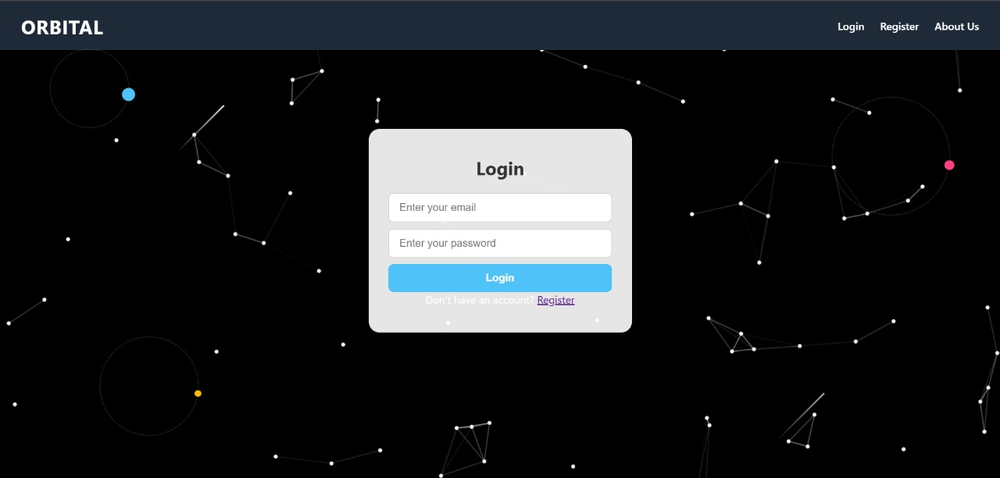
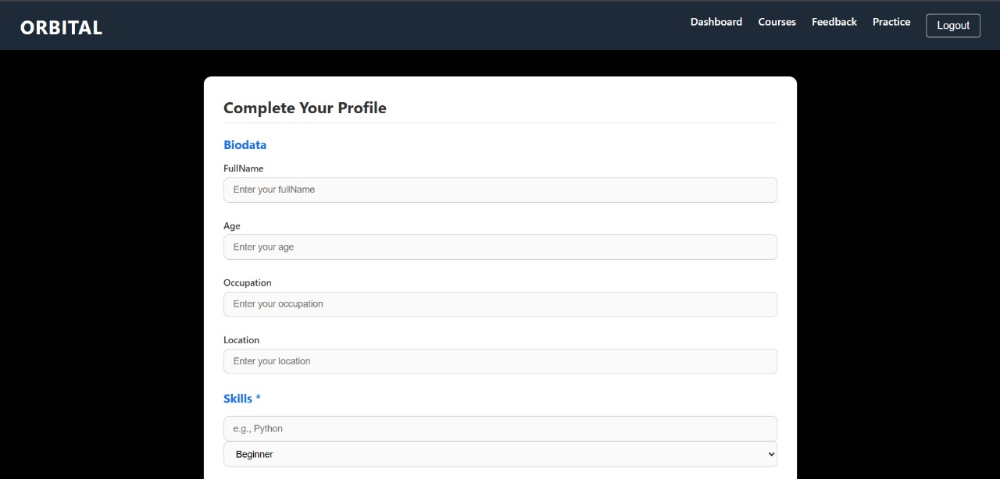
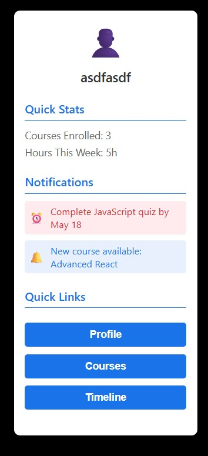
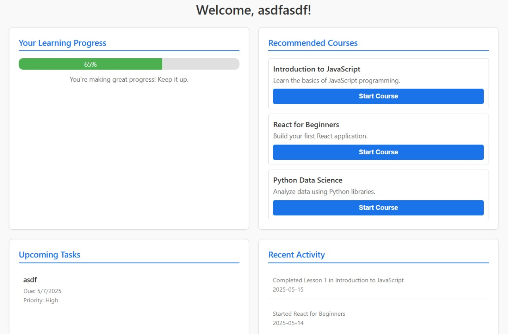
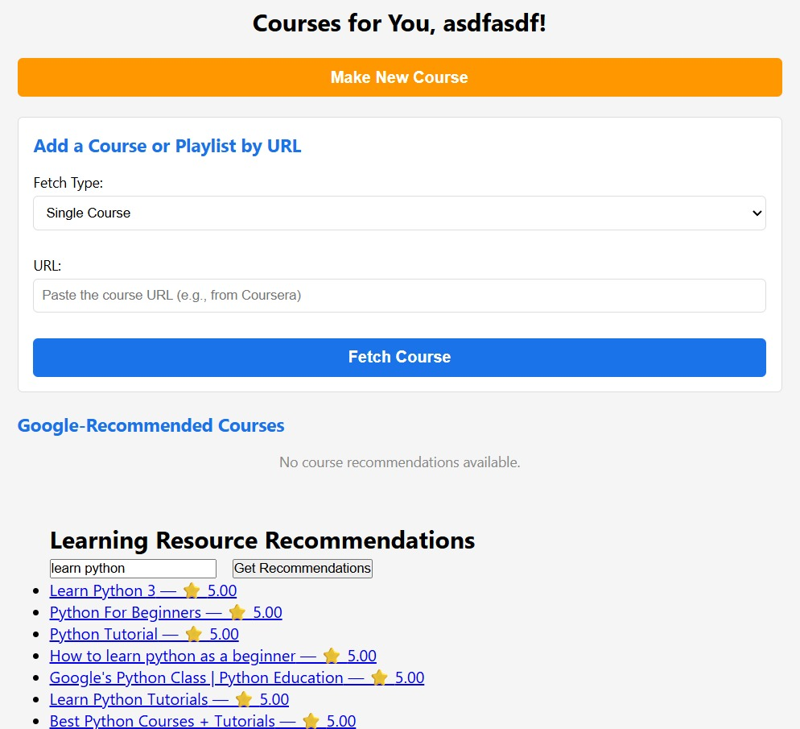

# 🚀 Orbital – Personalized Learning Recommender

Orbital is a course recommendation system built using MERN and Python. It helps users discover curated, personalized learning content based on their interests and proficiency.

## 🧠 Core Features

- 🔍 Search-based course retrieval using SerpAPI
- 📝 NLP-based relevance scoring for search results
- 🤖 Collaborative filtering logic
- 🛠️ Backend API with Flask + Python logic
- 📱 Clean frontend using React

---

## 🎥 Screenshots

### Login Page

### User Onboarding

### User Profile

### User Dashboard

### Recommendations

---

## 🔧 Tech Stack

- **Frontend:** React.js
- **Backend:** Node.js, Express.js
- **APIs:** SerpAPI for live data fetching, FastAPI for fetching data from recommendation engine to website
- **ML/NLP:** Scikit-learn
- **Database:** MongoDB

---

🏆 Hackathon Recognition
This project was built during HackVerse and received praise for its practical use case and implementation efficiency.

🤝 Contributors
[@jpabitraranjan](https://github.com/jpabitraranjan)

[@harshpatel976](https://github.com/harshpatel976)
